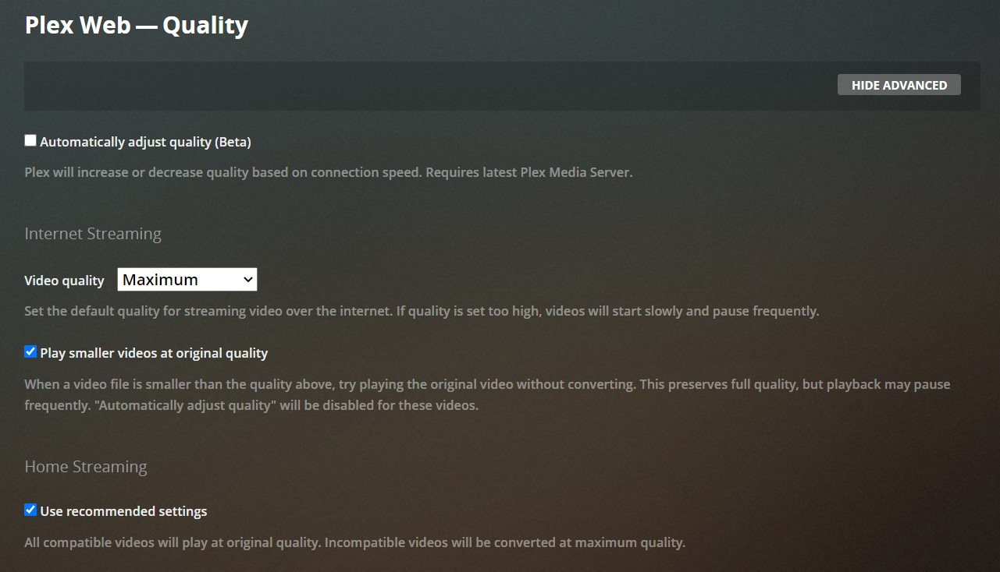
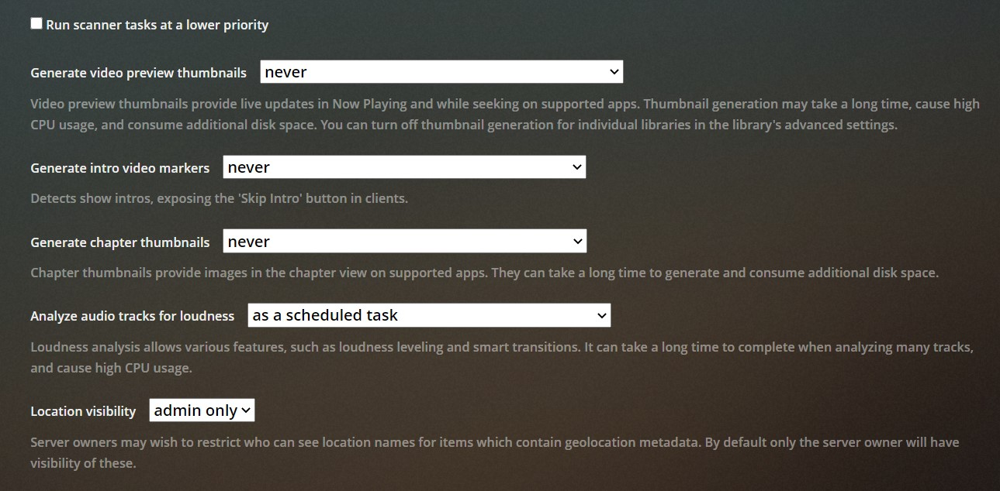

# Plex

Till now Radarr and Nzbget are communicating to each other. Now it is time to load up the downloaded content on Plex.

## 1. Settings

- Login to Plex

- First step is to change the quality to Maximum since you don't want Plex to transcode unnecessarily

- go to Settings-> Quality

  

- Now you would want to automatically update the library once Radarr sends a signal of a new download.

- For this, go to Settings->Library and then

  - Check "Scan Library automatically"
  - Check "Run partial Scan"
  - Uncheck "Scan my library periodically"
  - Uncheck "Empty trash automatically after every scan"
  - Choose "Never" to "Generate Video Preview Thumbnails", "Generate intro video markers" and "Generate chapter thumbnails"
  - These steps are done to minimize CPU processing and API calls to drive.

  

- Go to Settings->Transcoder and Enable "hardware acceleration"

  

- Go to Settings->Schedule Tasks and mark according to the image below.

  

## 2. Library

- 