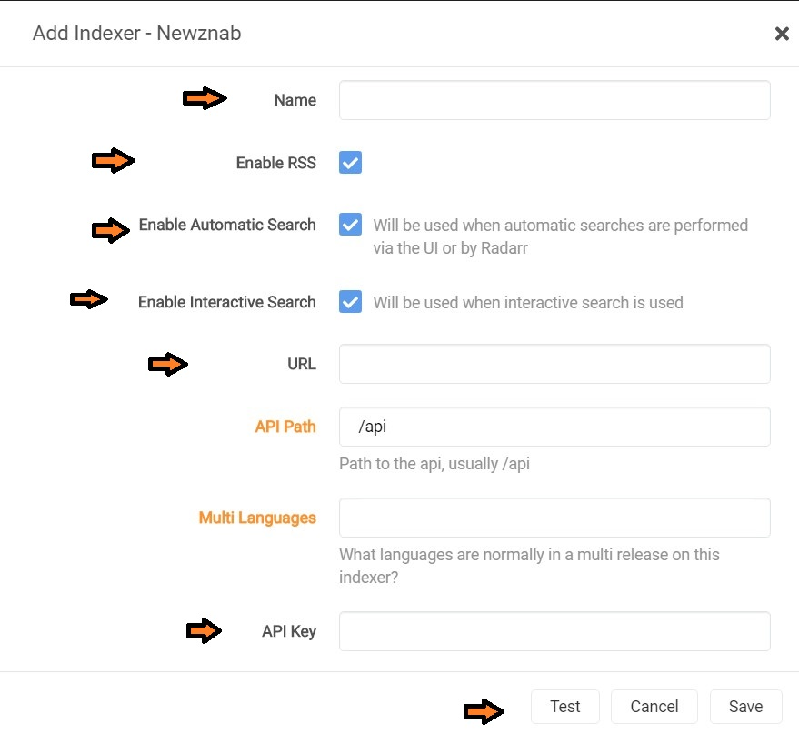
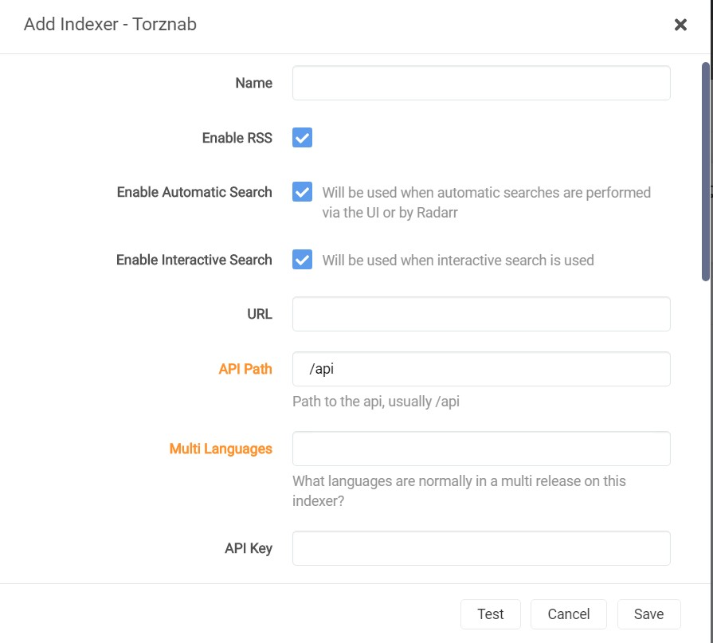
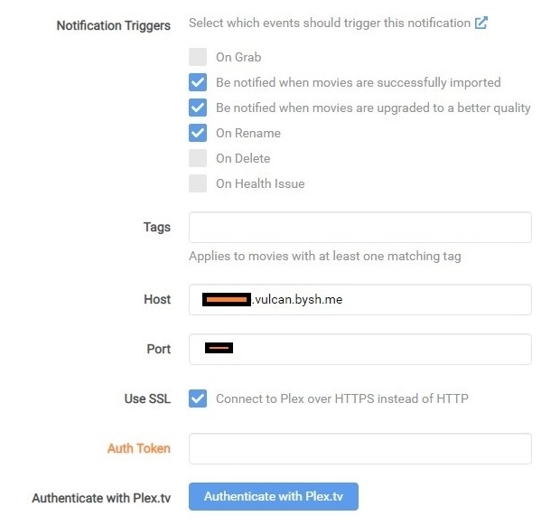
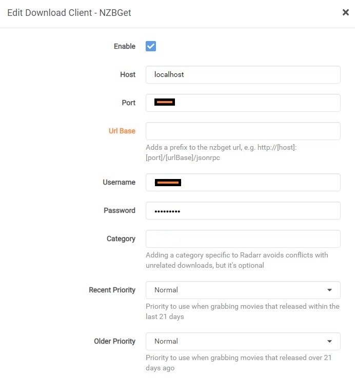

# Radarr

Note: These steps are for Radarr V3. If you are still in Radarr V2, you can refer [this guide](https://github.com/pranscript/plex_bytesized/blob/master/radarr/radarrV2%20to%20V3(nightly).md) to update to V3.

- The first step is to get Usenet indexers and torrent indexers.
- Go to settings and click on "Show advanced settings". This will be helpful to change some hidden settings.

### 1. Indexer Setup

- You will need Indexers that will locate NZB files on Usenet servers.

  - You can visit [this link](https://www.reddit.com/r/usenet/wiki/indexers) for all indexers.
  - I will recommend [nzbgeek](https://nzbgeek.info/), [drunkenslug](https://drunkenslug.com/), [nzbplanet](http://www.nzbplanet.net/).
  - You can get invites from [this link](https://www.reddit.com/r/UsenetInvites/).
  - At the starting one is enough. The aim is to pair 2-3 such that it covers all files. (Reddit research for this).

- Set up the indexers in Radarr by going to Settings->Indexers.

- Click on ""+"" to add an Indexer.

- You will have two options. Usenet Indexer and Torrent Indexer. Some predefined famous indexers are also there but we will choose custom settings.

- For Usenet Indexer, select if it is Newznab supported or Omgwtfnzbs supported. I will use Newznab as it the most common one we get.

  

- Fill out the details marked. URL and API key will be provided to you by the indexer and click on "Test" to check the connection

- After successful connection. Save it.


- For torrent indexers, we will use Jackett that we set up earlier. Remember that Jackett is helpful when you want to add many torrent indexers. You can follow this [Jackett guide](https://github.com/pranscript/plex_bytesized/tree/master/jackett) for more details if you haven't started that and then continue from here. 

- We will follow the similar steps to add a torrent indexers.

- Click on ""+"" and this time select "Torznab" since we are using Jackett to handle it for us

- Fill any name, copy Torzab URL and Jackett's API that we did during Jackett guide and put it here.

- Test the connection and save.

- Some might fail which is normal.

  


- After adding multiple, the indexer screen will look like this.

  

  

### 2. Setting up Profiles

- Go to Settings->Profiles to setup your custom requirement qualities you want to download or you can use already defined profiles

- Below is just an example which will keep on upgrading till Bluray-1080p is met. 

  

### 3. Setting up Quality

- Go to Settings->Quality to set the size of each quality you want to have. The rule is simple here. You don't want a less quality to have a large size. It is not worth it. Moreover, just follow "GB per hour rule" and the internet speed. 

- According to my experience, 100Mbps speed can stream a 30GB file size but struggles to play above 40GB (technically it should not but generally). Also for a file size close to 50GB or above, prefer having 200Mbps connection speed to stream without buffering.

- Below is an example. These are not perfect so you can set your own according to your needs.

  

### 4. Media Management

- This is an important step as content should be named correctly for plex to identify it correctly.

- Since we are not using Filebot or Olaris-rename, Radarr should rename all the files correctly.

- Radarr by default puts the file inside its movie folder which will come handy in future.

- The ultimate goal is to make plex understand the movie and and thus, accurate subtitles are fetched, so you can copy the following  format.

  - File Name Format - ```{Movie CleanTitle} {(Release Year)} {Edition Tags} [imdb-{ImdbId}] {[Quality Full]} {[MediaInfo 3D]} {[MediaInfo VideoDynamicRange]} [{MediaInfo VideoBitDepth}bit] {[MediaInfo VideoCodec]} {[MediaInfo AudioCodec}-{MediaInfo AudioChannels]}{-Release Group} ```
  - Folder Name Format- ```{Movie CleanTitle} {(Release Year)} [imdb-{ImdbId}]```

- Below is an example. Make sure "Title" along with "Year" is definitely there if not others, for Plex to work correctly.

  

### 5. Connect Plex to Radarr

- Do this step after installing your plex.

- Go to Settings->Connect

- This connection is necessary to inform plex about new content downloaded by Radarr so that Plex can automatically add content to its library.

- Host will be in this format - <username.servername> Both values can be found in the Bytesized dashboard.

  - If it didn't work, try Bytesized server I.P
  - Still didn't work then uncheck SSL. Do hit and trial and one combination will work.

- For Plex port, click on the "+" icon to see the port to connect to. 

- Use SSL, authenticate and uncheck update library

- Test the connection and save it.

  

  

### 6. Connect  Download client (Nzbget) for NZBs

- Go to Settings->Download Client

- Host is localhost as Radarr and Nzbget are installed locally so they can communicate within localhost connection

- Port you can find on the Bytesized dashboard by clicking the "+" icon on Nzbget card.

- Password is same password that you put while installing Nzbget.

- Mark it Enable, test the connection and Save.

  

### 7. Connect  Download client (Deluge) for torrents

- Same for Deluge
- Do remove Blackhole as download client.

### 8. Enable "Completed Download Handling"

- This is necessary to let Radarr fetch what is downloaded from both the download client, in our case Nzbget and Deluge.
- Go to Setting->Download Clients->Completed Download Handling
- Enable "Automatically Import Completed Downloads"

### 9. Import Library folder

- Go to Library Import->choose another folder
- Remember, path should be through "media_merge". For example
  - /home/hd*/username/mnt/media_merge/yourFolder

### 10. Restart Radarr

### 11. Additional Info (Optional )
1. You can put restrictions in Indexers. This will tell indexer was to and what not to download. For example, we definitely want h264, h265, x264, x265 in the filename. Just an example.
2. You can have advance control through custom format. Reddit research will help you on this. 


